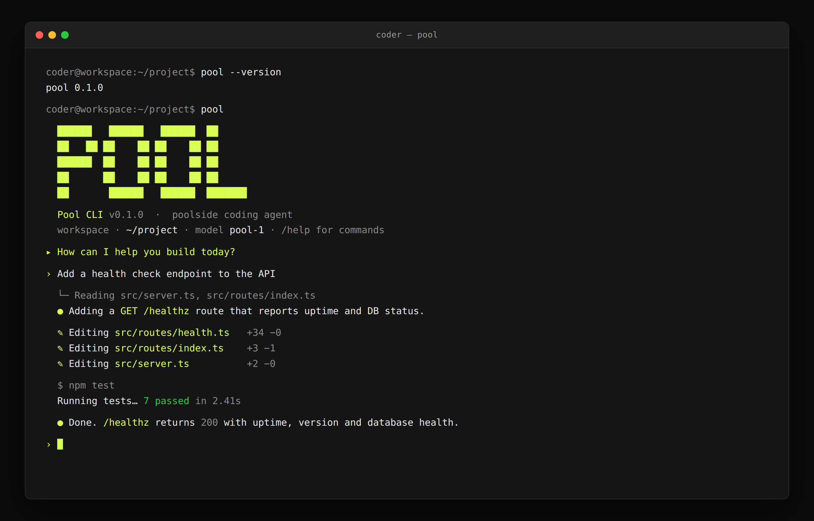

# Pool CLI

Install and configure [Pool](https://docs.poolside.ai/cli/pool), Poolside's coding agent, in your Coder workspace. The module installs the `pool` CLI, accepts its EULA noninteractively, and wires Pool's authentication and endpoints to Coder so developers get a ready-to-use agent without pasting credentials by hand.

```tf
module "pool" {
  source   = "registry.coder.com/coder-labs/pool/coder"
  version  = "0.1.0"
  agent_id = coder_agent.main.id

  poolside_api_key = var.poolside_api_key
}
```



The module accepts Pool's EULA noninteractively during installation, installs the CLI in `~/.local/bin` by default, and makes `pool` available to Coder scripts and interactive shells.

> [!NOTE]
> Pass secrets such as `poolside_api_key` through a `sensitive` Terraform variable (for example `var.poolside_api_key`) rather than inline literals, so keys never land in template source or state diffs. The `poolside_api_key` input is already marked `sensitive = true`.

## Dashboard entry point (`coder_app`)

Add a `coder_app` to give developers a one-click launcher for Pool from the Coder dashboard. The module installs and configures the CLI; the app opens an interactive session.

```tf
locals {
  pool_workdir = "/home/coder/project"
}

module "pool" {
  source   = "registry.coder.com/coder-labs/pool/coder"
  version  = "0.1.0"
  agent_id = coder_agent.main.id

  poolside_api_key = var.poolside_api_key
}

resource "coder_app" "pool" {
  agent_id     = coder_agent.main.id
  slug         = "pool"
  display_name = "Pool"
  icon         = "/icon/poolside.svg"
  open_in      = "slim-window"
  command      = <<-EOT
    #!/bin/bash
    set -e
    cd "${local.pool_workdir}"
    pool
  EOT
}
```

> [!NOTE]
> The `coder_app` command re-executes on every reconnect. This suits interactive `pool` (which stays alive). To keep a single long-lived session across reconnects and relaunches, use the persistent-session pattern in [Session continuity](#session-continuity).

## Session continuity

Run Pool once inside a persistent `tmux` session so the conversation survives dashboard reconnects and app relaunches. A `coder_script` starts the session on workspace start, and the `coder_app` attaches to that same session instead of launching a new `pool` process each time.

```tf
locals {
  pool_workdir = "/home/coder/project"
}

module "pool" {
  source   = "registry.coder.com/coder-labs/pool/coder"
  version  = "0.1.0"
  agent_id = coder_agent.main.id

  poolside_api_key = var.poolside_api_key
}

resource "coder_script" "pool_session" {
  agent_id     = coder_agent.main.id
  display_name = "Start Pool session"
  run_on_start = true
  script       = <<-EOT
    #!/bin/bash
    set -euo pipefail
    trap 'coder exp sync complete pool-session' EXIT
    coder exp sync want pool-session ${join(" ", module.pool.scripts)}
    coder exp sync start pool-session

    cd "${local.pool_workdir}"
    tmux new-session -d -s pool 'pool'
  EOT
}

resource "coder_app" "pool" {
  agent_id     = coder_agent.main.id
  slug         = "pool"
  display_name = "Pool"
  icon         = "/icon/poolside.svg"
  command      = <<-EOT
    #!/bin/bash
    set -e
    exec tmux new-session -A -s pool 'pool'
  EOT
}
```

`tmux new-session -A -s pool` attaches to the `pool` session created by the `coder_script` if it exists, or starts it otherwise, so developers always land back in the same running agent session.

## AI governance

Coder can govern how Pool authenticates and where its traffic goes.

### AI Gateway

[AI Gateway](https://coder.com/docs/ai-coder/ai-gateway) is a Premium Coder feature that provides centralized LLM proxy management, auditing, and attribution. Requires Coder >= 2.30.0.

Pool speaks to OpenAI-compatible endpoints through `POOLSIDE_STANDALONE_BASE_URL`. Set `enable_ai_gateway = true` to point Pool at Coder's OpenAI-compatible AI Gateway endpoint (`/api/v2/ai-gateway/openai/v1`) and authenticate with the workspace owner's Coder session token. Coder then governs auth and routing centrally: developers never handle a provider key, and every request is attributed and audited.

```tf
module "pool" {
  source   = "registry.coder.com/coder-labs/pool/coder"
  version  = "0.1.0"
  agent_id = coder_agent.main.id

  enable_ai_gateway = true
  model             = "gpt-5"
}
```

> [!CAUTION]
> `enable_ai_gateway = true` is mutually exclusive with `poolside_api_key` and `standalone_base_url`. AI Gateway supplies both the endpoint and authentication.

### Agent Firewall

[Agent Firewall](https://coder.com/docs/ai-coder/agent-firewall) enforces a network egress allowlist around an agent so Pool can only reach approved destinations. Install the [`agent-firewall`](https://registry.coder.com/modules/coder/agent-firewall) module and run `pool` through its wrapper to apply policy enforcement:

```tf
module "pool" {
  source   = "registry.coder.com/coder-labs/pool/coder"
  version  = "0.1.0"
  agent_id = coder_agent.main.id

  poolside_api_key = var.poolside_api_key
}

module "agent-firewall" {
  source   = "registry.coder.com/coder/agent-firewall/coder"
  version  = "0.0.3"
  agent_id = coder_agent.main.id
}

resource "coder_app" "pool" {
  agent_id     = coder_agent.main.id
  slug         = "pool"
  display_name = "Pool (Agent Firewall)"
  icon         = "/icon/poolside.svg"
  command      = <<-EOT
    #!/bin/bash
    set -e
    exec tmux new-session -A -s pool \
      '"${module.agent-firewall.agent_firewall_wrapper_path}" --config="${module.agent-firewall.agent_firewall_config_path}" -- pool'
  EOT
}
```

Add Pool's runtime endpoints (see [Network access](#network-access-and-air-gapped-environments)) to the Agent Firewall allowlist so requests are not blocked.

## OpenAI-compatible endpoints

Use `standalone_base_url` to configure another OpenAI-compatible proxy or local inference server. Provide `poolside_api_key` when that endpoint requires authentication; `model` selects the model if the endpoint does not provide a default.

```tf
module "pool" {
  source   = "registry.coder.com/coder-labs/pool/coder"
  version  = "0.1.0"
  agent_id = coder_agent.main.id

  poolside_api_key    = var.gateway_api_key
  standalone_base_url = "https://gateway.example.com/v1"
  model               = "my-coding-model"
}
```

For a Poolside deployment, use `poolside_api_url` to set `POOLSIDE_API_URL` instead.

## Existing installations

Set `install_pool = false` when Pool CLI is already present in your workspace image. Configure `pool_binary_path` if the binary is in a directory other than `~/.local/bin`.

## Network access and air-gapped environments

The table lists every external endpoint the module contacts, so you can pre-approve them in an allowlist or mirror them in a restricted network.

| Phase   | Endpoint                                                                    | When                                      | How to override                                                        |
| ------- | --------------------------------------------------------------------------- | ----------------------------------------- | ---------------------------------------------------------------------- |
| Install | `https://downloads.poolside.ai/pool/install.sh` (+ the binaries it fetches) | `install_pool = true` (default)           | `install_url` (script), or `install_pool = false` to skip entirely     |
| Runtime | Poolside's hosted API                                                       | Default, when no endpoint override is set | `poolside_api_url` for a Poolside deployment                           |
| Runtime | Coder deployment `access_url` (`/api/v2/ai-gateway/...`)                    | `enable_ai_gateway = true`                | Already internal to your deployment                                    |
| Runtime | `standalone_base_url`                                                       | When set                                  | Point at an internal OpenAI-compatible proxy or local inference server |

For restricted or air-gapped workspaces:

- **Mirror the installer.** Set `install_url` to an internal copy of `install.sh` (and mirror the binaries it downloads), or bake Pool into the image and set `install_pool = false`.
- **Keep model traffic internal.** Route requests through AI Gateway (`enable_ai_gateway = true`) or an internal OpenAI-compatible endpoint (`standalone_base_url`) instead of Poolside's hosted API.
- **Enforce egress.** Combine with [Agent Firewall](#agent-firewall) to allow only the endpoints above.

```tf
module "pool" {
  source   = "registry.coder.com/coder-labs/pool/coder"
  version  = "0.1.0"
  agent_id = coder_agent.main.id

  install_url         = "https://artifacts.internal.example.com/pool/install.sh"
  standalone_base_url = "https://llm.internal.example.com/v1"
  poolside_api_key    = var.gateway_api_key
}
```

## Serialize a downstream `coder_script` after installation

The `scripts` output is an ordered list of `coder exp sync` names created by the module.

```tf
resource "coder_script" "verify_pool" {
  agent_id     = coder_agent.main.id
  display_name = "Verify Pool CLI"
  run_on_start = true
  script       = <<-EOT
    #!/bin/bash
    set -euo pipefail
    trap 'coder exp sync complete verify-pool' EXIT
    coder exp sync want verify-pool ${join(" ", module.pool.scripts)}
    coder exp sync start verify-pool

    pool --version
  EOT
}
```

## Troubleshooting

The module's script logs are under `~/.coder-modules/coder-labs/pool/logs/`.

```bash
cat ~/.coder-modules/coder-labs/pool/logs/install.log
cat ~/.coder-modules/coder-labs/pool/logs/pre_install.log
cat ~/.coder-modules/coder-labs/pool/logs/post_install.log
```

## References

- [Pool CLI documentation](https://docs.poolside.ai/cli/pool)
- [Pool CLI installation](https://docs.poolside.ai/cli/install)
- [AI Gateway](https://coder.com/docs/ai-coder/ai-gateway)
- [Agent Firewall](https://coder.com/docs/ai-coder/agent-firewall)
