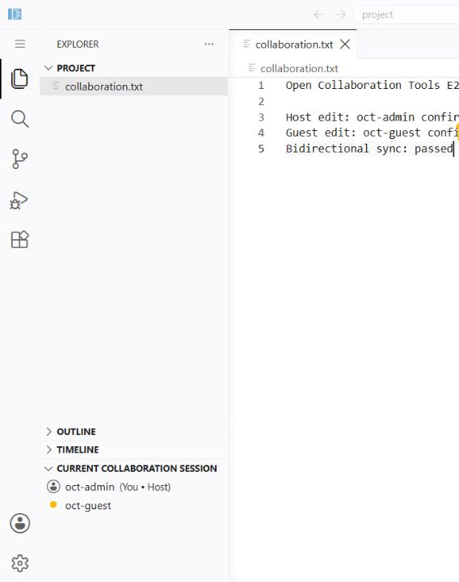
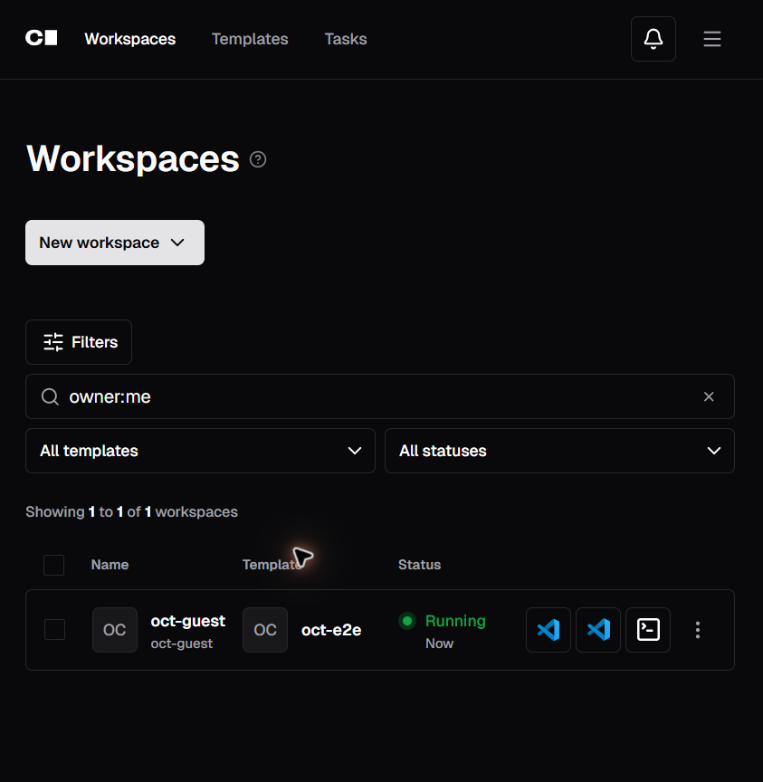

# Open Collaboration Tools

Configure the official Open Collaboration Tools (OCT) extension for live collaborative editing in a Coder web IDE. The module supplies settings and a versioned extension identifier that compose with the existing code-server or VS Code Web modules.

```tf
module "open_collaboration_tools" {
  source  = "registry.coder.com/edd88-pixel/open-collaboration-tools/coder"
  version = "1.0.0"

  server_url = "https://oct.example.com"
}

module "code_server" {
  count   = data.coder_workspace.me.start_count
  source  = "registry.coder.com/coder/code-server/coder"
  version = "1.4.1"

  agent_id   = coder_agent.main.id
  extensions = module.open_collaboration_tools.extensions
  settings   = module.open_collaboration_tools.settings
}
```





## How Coder and OCT fit together

Coder creates and secures the workspaces and web IDE entry points. A long-lived OCT server brokers collaboration sessions between the OCT extensions running in those IDEs. This module configures only the workspace-facing extension; it does not deploy the shared server or place OAuth credentials in a workspace or Terraform state.

OCT sessions are held in memory by the server. Do not run one server per workspace, and do not rely on a room surviving a server restart.

## VS Code Web

The same outputs compose with the VS Code Web module:

```tf
module "vscode_web" {
  count   = data.coder_workspace.me.start_count
  source  = "registry.coder.com/coder/vscode-web/coder"
  version = "1.1.0"

  agent_id       = coder_agent.main.id
  accept_license = true
  extensions     = module.open_collaboration_tools.extensions
  settings       = module.open_collaboration_tools.settings
}
```

When an IDE already contains the OCT extension, set `install_extension = false`. The module then returns an empty extension list while continuing to manage the OCT settings.

## Joining policy

The default `prompt` policy requires the host to approve every participant. An `allowlist` can admit selected usernames without prompting:

```tf
module "open_collaboration_tools" {
  source  = "registry.coder.com/edd88-pixel/open-collaboration-tools/coder"
  version = "1.0.0"

  server_url       = "https://oct.example.com"
  join_accept_mode = "allowlist"
  join_allowlist   = ["alice", "bob"]
}
```

Set `join_accept_mode = "auto"` only for a trusted environment where every authenticated OCT user may enter a hosted session without confirmation.

## Coder OAuth2 administrator setup

Coder's OAuth2 provider is experimental and should be enabled only after reviewing its current limitations. An administrator must enable the `oauth2` experiment, create an OAuth2 application, and register the exact OCT callback URL:

```text
https://oct.example.com/api/login/oauth-callback
```

Configure the external OCT service with its base URL, Coder's `/oauth2/authorize` and `/oauth2/tokens` endpoints, Coder's `/api/v2/users/me` user-info endpoint, the `username` and `email` claims, and S256 PKCE. Inject `OCT_OAUTH_CLIENTSECRET` from the deployment's secret manager; never place it in a Coder template or workspace environment.

## Create and join a session

In the host IDE, run **Open Collaboration Tools: Create Collaboration Session**. After authentication, share the invitation code through a trusted channel. In the participant IDE, run **Open Collaboration Tools: Join Collaboration Session** and enter that invitation.

The published extension also exposes `oct.createRoom` and `oct.joinRoom` to other VS Code extensions. External desktop launchers can use the OCT `vscode://` join URI, but browser-hosted IDEs should use the commands inside the extension.

## Network and restricted environments

This module runs no scripts, requires no elevated privileges, and downloads nothing itself. With extension installation enabled, the selected IDE module contacts its configured extension marketplace to obtain `typefox.open-collaboration-tools`; at runtime, the extension contacts the configured OCT server, which redirects authentication to the Coder deployment.

For restricted environments, mirror or preinstall the extension through the IDE module or workspace image, set `install_extension = false`, and allow only the Coder and OCT origins required by the deployment. The OCT server and the browser must both be able to reach the Coder OAuth2 endpoints. No public OCT service is required.

## Server health check

The OCT server does not provide a home page. Opening its root URL can therefore return `Cannot GET /` even when the service is healthy. Use the metadata endpoint for a non-authenticated connectivity check:

```shell
curl --fail --show-error https://oct.example.com/api/meta
```

During an actual session, the extension also uses `/api/login/*` for authentication and `/api/session/*` for collaboration. Those routes require the appropriate request method and session context, so `/api/meta` is the clearer standalone health probe.

> [!WARNING]
> OCT does not share terminals or forwarded ports. A session also ends when its in-memory OCT server state is lost.
